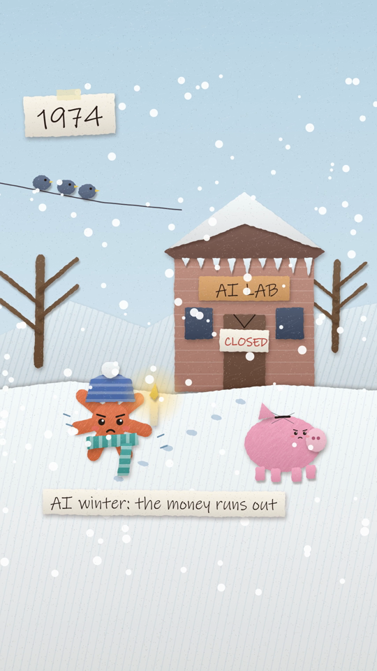
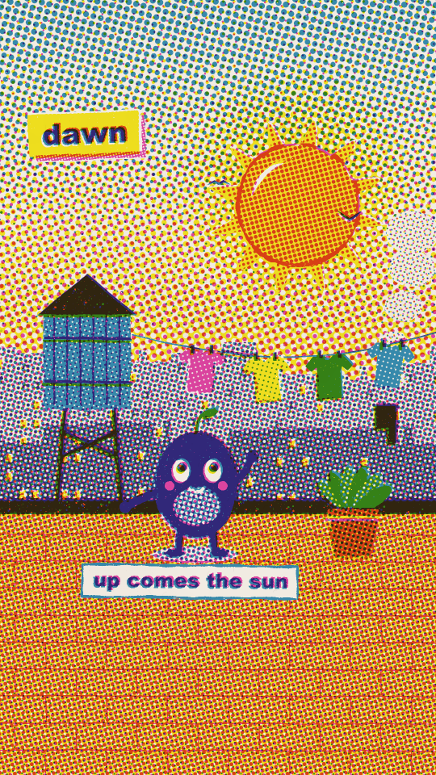
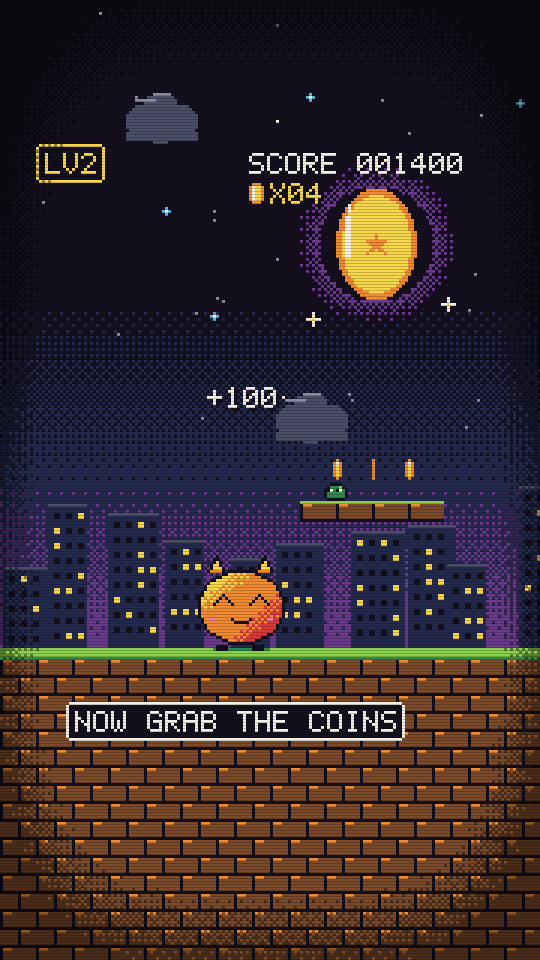
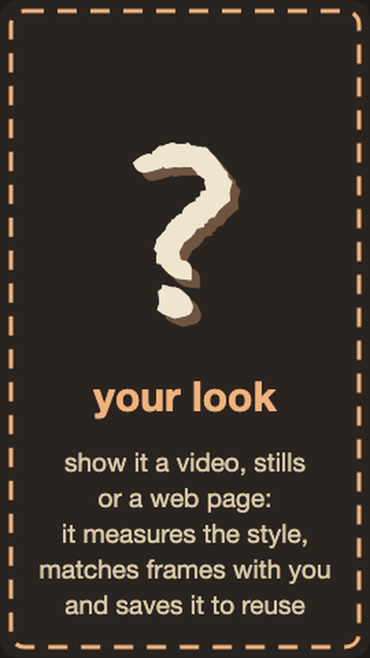
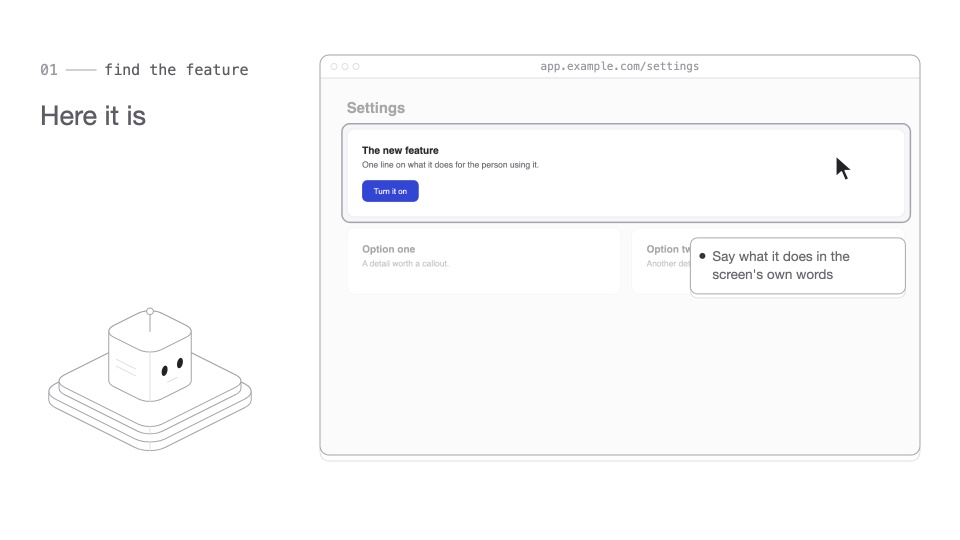

# animator

A [Claude Code](https://claude.com/claude-code) skill that makes short animations in code: website animations, social reels, product demos and feature releases, explainers. Each one is a single `<canvas>` page, drawn and scored procedurally, rendered to MP4 (and web-ready MP4/WebM for sites).

It asks what the animation is for first, then the style and the details, and checks in three times (story, look, storyboard) before it animates anything. Reviews are measured, not eyeballed.

- **Styles:** cut paper, crosshatch ink, riso print, sketchbook, manim-style math, pixel art, isometric line art, or a new one matched from your references.
- **Product tours:** a walkthrough of a real web app. It captures real screenshots, zooms from component to button, adds spotlights, callouts and a cursor that follows your click path, and crossfades between pages.
- **Sound:** a synthesized score on a 120 BPM grid, your own track, or a voice-over.

## Styles

<table>
<tr>
<td align="center" valign="top" width="25%"><br><b>Cut paper</b><br><sub>Torn paper, drop shadows, crayon, characters with faces</sub></td>
<td align="center" valign="top" width="25%"><br><b>Crosshatch ink</b><br><sub>Sketchy ink that boils, hatch and pencil shading</sub></td>
<td align="center" valign="top" width="25%"><br><b>Riso print</b><br><sub>Three-ink risograph: halftones, overprints, misregistration</sub></td>
<td align="center" valign="top" width="25%"><br><b>Sketchbook</b><br><sub>Graphite and one accent colour, hand lettering</sub></td>
</tr>
<tr>
<td align="center" valign="top" width="25%"><br><b>Math</b><br><sub>Manim-style: black stage, axes, graphs, colour-coded variables</sub></td>
<td align="center" valign="top" width="25%"><br><b>Isometric</b><br><sub>Product line art: hairlines, white faces, one dark accent</sub></td>
<td align="center" valign="top" width="25%"><br><b>Pixel art</b><br><sub>Low-res eras, drawn at true resolution and upscaled</sub></td>
<td align="center" valign="top" width="25%"><br><b>Custom</b><br><sub>Your own look from a video, stills or a web page, saved as a new style</sub></td>
</tr>
</table>

## Product tours



A walkthrough of a real web app: real screenshots, zooms from component to button, spotlights, callouts, and a cursor that follows your click path.

## Install

Needs Node 18+, ffmpeg (`brew install ffmpeg`) and Claude Code.

```bash
git clone https://github.com/WickeNeal/animator ~/.claude/skills/animator
cd ~/.claude/skills/animator && npm install && npx playwright install chromium
```

Optional, for word-timed voice-overs: `pip install faster-whisper`.

## Use

In Claude Code: `/animator`, or ask for an animation, e.g. "make a 10s hero animation for our landing page".
